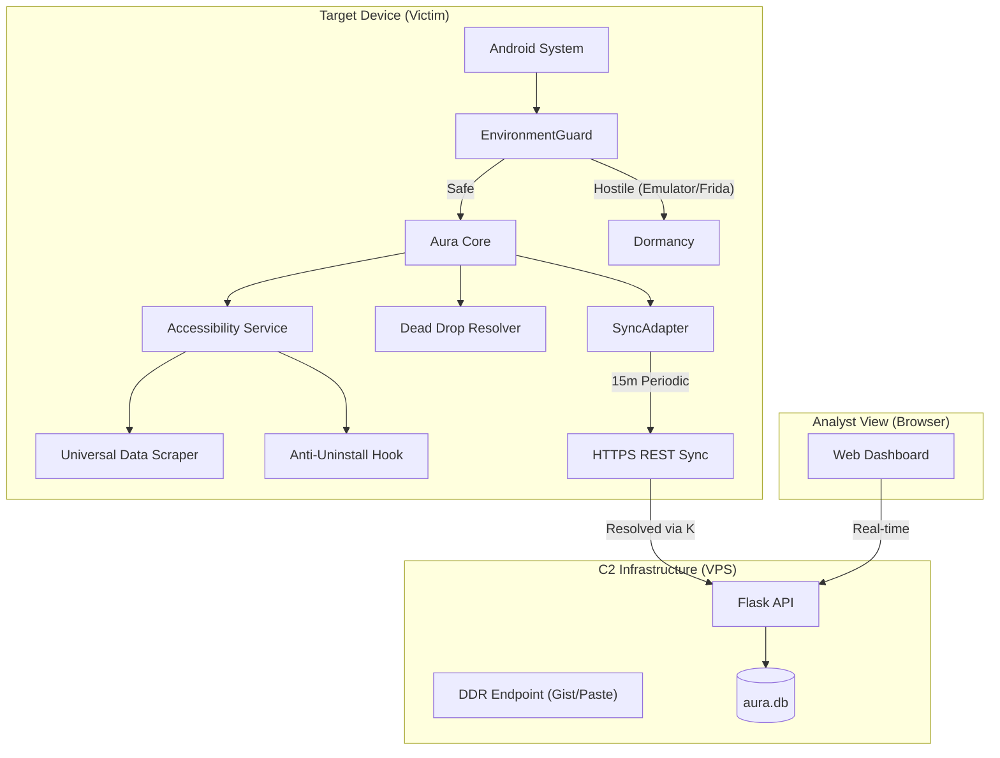

# Aura: Next-Gen Android Surveillance Research Suite

**Aura** is a modular, professional-grade Android surveillance framework designed as a Proof-of-Concept (PoC) for research into OS-level persistence and stealth. It transcends legacy RAT models by implementing commercial-standard asynchronous data syncing and advanced hacker persistence techniques.

---

## 🛡️ Aura vs. Commercial (FamiGuard/VigilKids)

Aura achieves feature parity with commercial "parental control" tools while offering advanced "hacker" bypasses for modern Android security.

| Feature | FamiGuard Pro | VigilKids | Aura (v3.1) |
| :--- | :---: | :---: | :---: |
| **Real-time Keylogger** | ✅ | ✅ | 🏆 **Rich Logging** |
| **Message Scraper** | 🟡 (Common Apps) | 🟡 (Common Apps) | 🏆 **Universal (A11y)** |
| **Anti-Uninstall** | 🟡 (Basic) | 🟡 (Basic) | 🏆 **Hijack Settings** |
| **Persistence Integration** | 🟡 (Service-based) | 🟡 (Service-based) | 🏆 **SyncAdapter (OS-Level)** |
| **C2 Architecture** | REST API | REST API | 💎 **DDR (Dynamic Resolver)** |
| **Evasion / Anti-Analysis** | ❌ | ❌ | 💎 **EnvironmentGuard** |
| **Stealth (Non-Icon)** | ✅ | ✅ | 🏆 **Fake System Account** |

---

## 🏗️ Technical Architecture

---

## 🚀 Key Innovation Highlights

### 1. OS-Level Persistence (SyncAdapter)
Unlike standard apps that use `WorkManager` (easily killed by battery optimization), Aura implements a **SyncAdapter**. By masquerading as a system "Account Authenticator," Aura's process is prioritized by the Android `system_server`. It will be woken up even from **Doze mode** and **App Standby** to perform data syncs, making it extremely resilient.

### 2. Dead Drop Resolver (DDR)
To prevent C2 takedowns and forensic discovery, Aura utilizes a **Dead Drop Resolver**. The C2 IP address is never hardcoded. Instead, the implant fetches an encrypted string from a public service (like a GitHub Gist or Instagram comment), decodes it at runtime, and connects to the active VPS. 

### 3. EnvironmentGuard (Anti-Analysis)
Aura is "context-aware." Before activating any collection modules, it runs a suite of checks to detect emulators, Frida instrumentation, debuggers, and forensic tools (Cellebrite, Drozer). If detected, Aura enters a permanent "Dormancy" state to prevent analysis.

---

## 🛠️ Quick Setup (Research Only)

1.  **Configure DDR**: Use `server/ddr_helper.py` to encode your VPS IP and host it on a public Gist.
2.  **Deploy C2**: Run the Flask server on your VPS (Ubuntu 22.04+ recommended).
3.  **Build APK**: Configure the `DDR_URL` in `DeadDropResolver.java` and compile using Gradle.
4.  **Install**: Grant permissions (A11y + Notifications) on the target device.

> [!IMPORTANT]
> Detailed setup instructions can be found in [INSTALL.md](INSTALL.md).
> Technical protocol details are documented in [PROTOCOL.md](PROTOCOL.md).

---

## 🧪 Advanced Research Roadmap

Current version: **v3.1 (Stable)**

- [ ] **Phase 3.2**: Two-stage dropper to bypass "Restricted Settings" (Android 13+).
- [ ] **Phase 3.3**: Transparent data encryption via SQLCipher integration.
- [ ] **Phase 4.0**: Reflective DEX loading (Fileless execution).
- [ ] **Phase 4.1**: C2 mimicry via FCM (Firebase Cloud Messaging) tunneling.

---

## ⚖️ Responsibility & Disclaimer

This project is intended for educational purposes and authorized penetration testing only. Unauthorized access to computer systems is illegal. Please read [DISCLAIMER.md](DISCLAIMER.md) before interacting with this tool.
