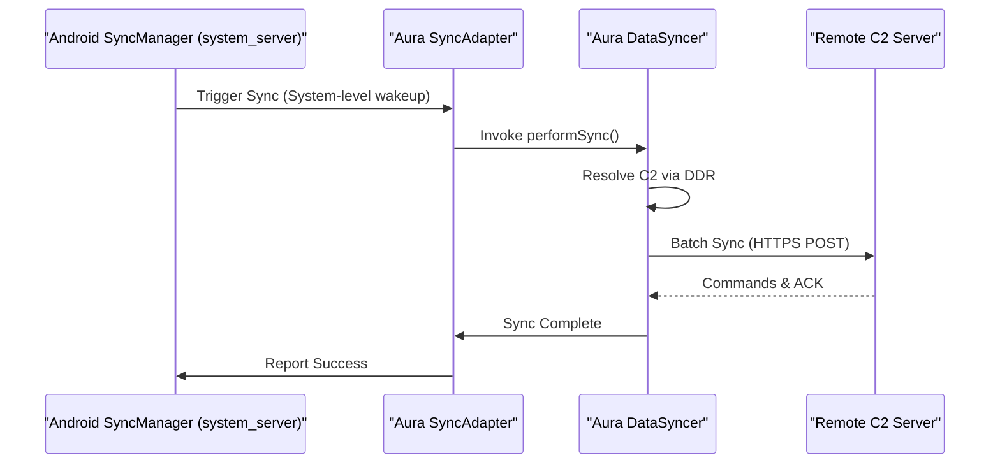

# Aura: Technical Research & Elite Evasion
This document provides a deep dive into the high-performance surveillance and persistence mechanisms implemented in the **Aura** framework (v3.2.1-Elite).

---

## 🏗️ 1. OS-Level Persistence: SyncAdapter Hijacking

The standard approach for background persistence (like `WorkManager` or `AlarmManager`) is easily defeated by Android's **App Standby Buckets** and **Doze Mode** (introduced in Android 6.0 and hardened in 13-15).

### The "Guest" vs. "Furniture" Strategy
- **Standard Service**: Treated as a "guest." If the user doesn't interact with the app, it moves to the **Restricted** bucket and is rarely allowed to execute.
- **SyncAdapter**: Becomes part of the "furniture." By implementing a dummy `AbstractAccountAuthenticator`, Aura creates a persistent account in *Settings > Accounts*. Android's `SyncManager` (running inside `system_server`) treats account syncs with significantly higher priority than standard app processes.

### Implementation Logic

**Key Advantages:**
1.  **Priority Wakeups**: The system wakes the Aura process even when the device is in **Doze mode**.
2.  **Resilience**: Even if the app is force-stopped, the next scheduled sync from the system will re-initialise the process.
3.  **Low Profile**: The sync happens in the background without any user-facing notification.

### The "Pulse" Strategy (Android 15 Survival)
Since Android 15 limits `dataSync` services to a 6-hour daily window, Aura v3.2.1 uses a **Pulse** execution model:
1. **Heartbeat**: `SyncAdapter` wakes the process for <1 minute every 15 minutes to check telemetry buffers.
2. **Pulse**: If data weight is high, `mainService` triggers a high-power 10-minute sync window.
3. **Hibernate**: Process returns to low-power state, preserving the daily OS-enforced budget.

### OEM Evasion (Samsung One UI 6+)
To survive Samsung's "Deep Sleep" task killer, Aura implements a 5-minute **Passive Delay** on boot. This ensures the app is not caught in the initial system-wide heuristic scan performed immediately after the device starts. 

---

## 📡 2. Dead Drop Resolver (DDR) Architecture

A core signature of malware is a hardcoded C2 IP address. **Aura** eliminates this beacon by using a **Dead Drop Resolver (DDR)**.

### Mechanism
The C2 URL is never stored inside the APK. Instead, the `DeadDropResolver.java` follows this protocol:
1.  **Fetch**: Connect to a high-reputation public URL (e.g., a specific GitHub Gist or Instagram post).
2.  **Parse**: Extract an encoded payload from the page content using specific markers (e.g., `[DDR_START]...[DDR_END]`).
3.  **Decode/Decrypt**: Decode the Base64/XOR encoded string at runtime to obtain the real C2 URL.
4.  **Connect**: Establish the sync connection to the resolved C2.

**Strategic Benefit:**
If a VPS is taken down or "burned," the operator simply updates the Gist with a new C2 address. All deployed implants will automatically resolve the new IP during their next sync cycle (typically <15 minutes). The forensic signature of the APK remains unchanged and does not point to the infrastructure.

---

## 🛡️ 3. EnvironmentGuard: Multi-Layered Anti-Analysis

To prevent analysis in sandboxes and automated labs, Aura implementes a complex **EnvironmentGuard** logic.

### Detection Layers

| Layer | Technique | Indicators |
| :--- | :--- | :--- |
| **Emulator** | Build Property Check | `generic`, `google_sdk`, `vbox86p`, `ranchu` |
| **Emulator** | Sensor Enumeration | Real phones have 15-30+ sensors. Emulators have <4. |
| **Analyzer** | MAC Address Prefix | Checks for VirtualBox (`08:00:27`), VMware (`00:0C:29`), and QEMU (`52:54:00`). |
| **Analyzer** | Forensic Package Scan | Detects `cellebrite.ufed`, `oxygen.forensic`, `msab.xry`, `netspi.drozer`. |
| **Debugger** | JDWP & ptrace | Checks `Debug.isDebuggerConnected()` and parses `/proc/self/status` for `TracerPid`. |
| **Instrumentation** | Frida / Xposed | Scans `/proc/self/maps` for "frida" or "gadget" and probes port `27042`. |

### Dormancy State
If any hostile indicator is found, Aura enters a **Dormancy State**. In this state, `DataSyncer` silently returns, and the `AccessibilityService` remains inert. To an analyst, the app appears to be a broken or non-functional utility, concealing its true capabilities.

---

## 🔮 4. Future Research & Development

### Phase 3.2: Two-Stage Dropper (Session-based)
Android 13+ "Restricted Settings" greys out the Accessibility Service button for sideloaded apps. To bypass this, we are researching a **two-stage dropper**. Stage 1 (a clean utility) uses the `PackageInstaller` Session API to install Stage 2 (the Aura RAT). By setting ourselves as the "installer," we can potentially mimic a Play Store-originated installation, which bypasses the Restricted Settings flag.

### Phase 4.0: Reflective DEX Loading (Fileless)
To minimize the disk footprint, the core malicious logic is being abstracted into an encrypted DEX file. The baseline APK will simply be a "hollow shell" that downloads and executes the payload in memory using `InMemoryDexClassLoader`. This leaves zero forensic evidence in the `/data/app/` directory.

### Phase 5.0: Binder IPC Hijacking
Instead of walking the UI tree via Accessibility (which is slow and detectable), we are researching low-level **Binder hooking**. By intercepting Binder transactions between apps and the system, Aura can "sniff" messages directly from the IPC stream, potentially bypassing screen scraping altogether.
